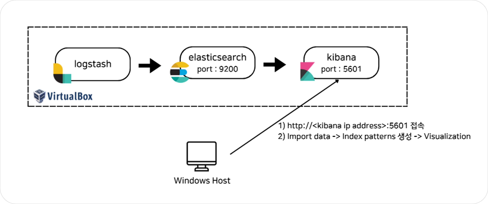
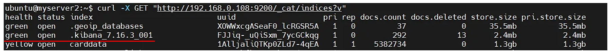
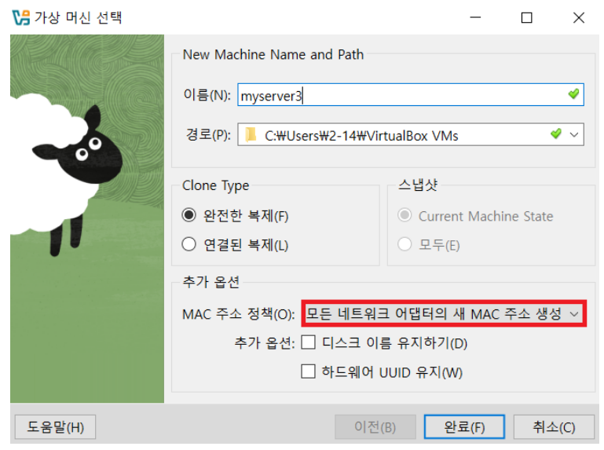

# ELK Stack 설치 가이드

<br>

Ubuntu 기반 VirtualBox 가상머신 환경에서 Elasticsearch, Logstash, Kibana 설치 과정을 정리했다.

아키텍처 설계부터 설치 단계, 버전 선택 이유, VM 복제 시 발생할 수 있는 트러블슈팅까지 포함한다.

<br>

## 0. 설정 파일 개념정리

ELK 스택을 설치하면 여러 개의 설정 파일을 다루게 된다. 

대표적으로는 **.yml**(YAML 포맷)과 **.conf**(Logstash용 파이프라인 설정 파일)가 있다.

<br>

### ① .yml 파일 (YAML 설정 파일)

• 대상: elasticsearch.yml, logstash.yml, kibana.yml

• 목적: 서비스 자체의 **전역 설정**을 정의

&thinsp; \- 네트워크 접근 범위( network.host ) <br> &thinsp; \- 포트( http.port ) <br> &thinsp; \- 클러스터 모드( discovery.type )


• 특징: 들여쓰기 기반 구조 (JSON보다 사람이 읽고 쓰기 편리함)

• 주의사항: 탭(tab) 대신 <strong>공백(space)</strong>을 써야함 (YAML 문법 오류 방지)

※ 잘못된 값 입력 시, 서비스 시작 자체가 실패할 수 있음

※ 수정 후에는 항상 <strong>systemctl restart <서비스명></strong>으로 재시작하고 필요함

<br>

### ② .conf 파일

• 대상: Logstash **(/etc/logstash/conf.d/*.conf)**

• 목적: Logstash의 데이터 흐름(파이프라인)을 정의, 크게 **input → filter → output** 구조

&thinsp; \- Input: 데이터가 어디서 들어오는지 (예: Filebeat, syslog, csv 파일) <br> &thinsp; \- Filter: 들어온 데이터를 가공하는 단계 (예: grok 패턴, mutate, json 파싱) <br> &thinsp; \- Output: 어디로 내보낼지 (예: Elasticsearch, 콘솔)

• 특징: conf 파일은 여러 개를 동시에 둘 수 있음, Logstash가 전부 읽어 실행

※ 문법 오류가 있으면 Logstash 서비스가 실행되지 않음

※ **sudo systemctl status logstash**나 로그 확인 필수

<br>

## 1. 전체 아키텍처 

Ubuntu 20.04 LTS **VM 3대**를 활용하여 ELK 스택을 구축함



<br>

### ① VirtualBox

• 위의 모든 구성 요소(Logstash, Elasticsearch, Kibana)를 VirtualBox에서 실행시킴

• 각 VM의 네트워크 어댑터를 **브리지 어댑터**로 설정함

• 모든 VM을 **동일한 서브넷**에 연결해 VM간 원활한 통신을 보장함

<br>

### ② Windows Host

• 사용자 환경에서 **Kibana Web 인터페이스**를 통해 데이터를 시각화하고 분석함

• 브라우저에서 VM의 Kibana가 사용하는 IP주소와 포트(예: `http://<Kibana IP>:5601`)를 입력함

• Kibana 대시보드에 접속하여 데이터 시각화 및 분석 수행함

<br>

## 2. Ubuntu에 ELK 설치 가이드

### ✅ Java 설치 확인

\- Elasticsearch 7.16.3은 Java 8 이상이 필요함

```
# Java 설치 확인
java -version

# Java가 설치되어 있지 않다면 OpenJDK 11 설치
sudo apt update
sudo apt install -y openjdk-11-jdk
```

<br>

### ✅ Elasticsearch 설치 및 설정

1\. Elasticsearch GPG 키 추가

```
wget -qO - https://artifacts.elastic.co/GPG-KEY-elasticsearch | sudo apt-key add -
```

2\. Elastic 패키지 저장소 추가

```
echo "deb https://artifacts.elastic.co/packages/7.x/apt stable main" | sudo tee /etc/apt/sources.list.d/elastic-7.x.list
```

3\. 패키지 리스트 업데이트 후 Elasticsearch 설치

```
sudo apt update
sudo apt install -y elasticsearch=7.16.3
```

4\. Elasticsearch 서비스 활성화

```
# Elasticsearch 자동 시작 활성화
sudo systemctl enable elasticsearch

# Elasticsearch 시작
sudo systemctl start elasticsearch

# 정상적으로 실행 중인지 확인
sudo systemctl status elasticsearch
```

5\. Elasticsearch 설정 파일 (yml) 변경

```
# 1개의 Elasticsearch 노드만 실행시킬 것이기 때문에 단일 노드로 설정

sudo vi /etc/elasticsearch/elasticsearch.yml

cluster.name: my-cluster     # 클러스터 이름
node.name: my-node           # 노드 이름
discovery.type: single-node  # 🔥단일 노드 모드 활성화🔥

# 네트워크 설정
network.host: 0.0.0.0        # 외부에서도 접근 가능하게 설정
http.port: 9200              # HTTP 요청 포트
```

6\. Elasticsearch 재시작 및 연결 확인

```
# Elasticsearch 재시작
sudo systemctl restart elasticsearch

# 상태 확인
sudo systemctl status elasticsearch

# 연결 확인
curl -X GET "http://localhost:9200/"
```

<br>

### ✅ Logstash 설치 및 설정

1\. Logstash 패키지 다운로드 및 설치

```
wget https://artifacts.elastic.co/downloads/logstash/logstash-7.16.3-amd64.deb
sudo dpkg -i logstash-7.16.3-amd64.deb
```

2\. Logstash 설정 파일 (yml) 변경

```
sudo vi /etc/logstash/logstash.yml

path.data: /var/lib/logstash
path.logs: /var/log/logstash
http.host: "0.0.0.0"   #🔥모든 인터페이스에서 수신 허용🔥
```

3\. Logstash 구성 파일 (conf)

```
# 구성 파일 (`/etc/logstash/conf.d/logstash.conf`)를 생성하여 🔥입력 및 출력 파이프라인을 설정🔥

# 본 프로젝트에서는 Kibana에서 csv 데이터를 직접 import하여 사용

sudo vi /etc/logstash/conf.d/logstash.conf

# 파일 예제 - Filebeat 활용 시 
input {
    beats {
        port => 5044
    }
}
output {
    elasticsearch {
        hosts => ["http://<Elasticsearch_IP>:9200"]
        index => "logstash-%{+YYYY.MM.dd}"
    }
    stdout { codec => rubydebug }
}
```

4\. Logstash 시작 및 상태 확인

```
sudo systemctl start logstash
sudo systemctl enable logstash
sudo systemctl status logstash
```
<br>

### ✅ Kibana 설치 및 설정

1\. Kibana 패키지 다운로드 및 설치

```
wget https://artifacts.elastic.co/downloads/kibana/kibana-7.16.3-amd64.deb
sudo dpkg -i kibana-7.16.3-amd64.deb
```

2\. Kibana 설정 파일 (yml) 변경

```
sudo vi /etc/kibana/kibana.yml

server.host: "0.0.0.0"     # 🔥외부에서 접속 가능하도록 설정🔥
elasticsearch.hosts: ["http://<Elasticsearch_IP>:9200"]
```

3\. Kibana 시작 및 상태 확인

```
sudo systemctl start kibana
sudo systemctl enable kibana
sudo systemctl status kibana
```

<br>

### ✅ Host 웹 브라우저에서 접속 확인

• Elasticsearch: 브라우저에서 **http://<Elasticsearch_IP>:9200**에 접속하여 Elasticsearch 상태 확인

• Kibana: 브라우저에서 **http://<Kibana_IP>:5601**에 접속하여 Kibana 대시보드 확인

• Logstash : Data import(index : carddata) 후 index 확인



<br>

## 3. ElasticSearch 7.16.3 버전 선택 이유

  | **항목**            | **8.x 버전**                                      | **7.x 버전**                                      |
  |---------------------|------------------------------------------------------------|------------------------------------------------------------|
  | **보안**       | TLS/SSL 암호화, 인증 설정 등 보안 기능 포함, 운영 환경에서 보안성 높음 | 보안 설정 없음, 상대적으로 간단하고 빠른 설정 가능            |
  | **설정 복잡도**     | 보안 설정을 추가해야 하므로 설정이 복잡하고 관리 어려울 수 있음 | 보안 설정 필요 없음, 설정 간단하여 학습용으로 용이            |
  | **성능 개선**       | 성능 및 기능 개선 많음, 하지만 학습에 복잡할 수 있음           | 성능 개선이 적지만 안정적이고 쉽게 학습 가능                   |
  | **학습 용이성**     | 보안 설정 필요하여 학습이 복잡해질 수 있음                     | 보안 설정 없이 바로 실습 가능, 빠르고 직관적인 학습 가능        |
  | **기존 API와 호환성** | 새로운 기능을 제공하지만, 기존 API와 호환성 문제 가능         | 기존 7버전 API와 설정이 그대로 유지되어 혼동 적음              |
  | **적합성**          | 운영 환경에서 보안 및 성능 면에서 유리하지만 학습에는 불편함     | 학습용으로 더 적합, 보안 설정 없이 빠르게 실습 가능              |

• 리눅스 설치 환경 학습을 목적으로, 보안 관련 복잡성이 적은 7.x 버전을 설치

• 7.16.x 버전은 Elasticsearch 7.x 시리즈에서 제공하는 최신 기능들을 포함

• 7.16.3은 7.x 시리즈에서 커뮤니티의 활발한 지원을 받는 마지막 주요 버전 

• 7.16.3 버전은 보안 패치와 버그 수정이 완료되어 안정적

<br>

## 4. 트러블 슈팅

• **VM을 복제**해서 3대를 만들 때, **MAC 주소** 정책을 잘못 선택하면 문제가 생길 수 있다.

• 처음에 NAT 네트워크 어댑터의 MAC 주소만 복제되도록 설정했더니,

• 원본 VM과 복제된 VM이 같은 MAC 주소를 공유해서 네트워크 충돌이 발생했다.

<br>

### ✅ 해결 방법

• 설정 → 네트워크 → MAC 주소에서 새로운 MAC 주소를 재할당

• VM을 처음 복제할 때는 반드시 **모든 네트워크 어댑터에 대해 새 MAC 주소 생성**을 선택해야 함


</div>

<br>

• 또한 복제 시 hostname(호스트 이름)도 원본과 똑같이 복사되므로 변경이 필요함

```
sudo hostnamectl set-hostname <새로운_hostname>
```
